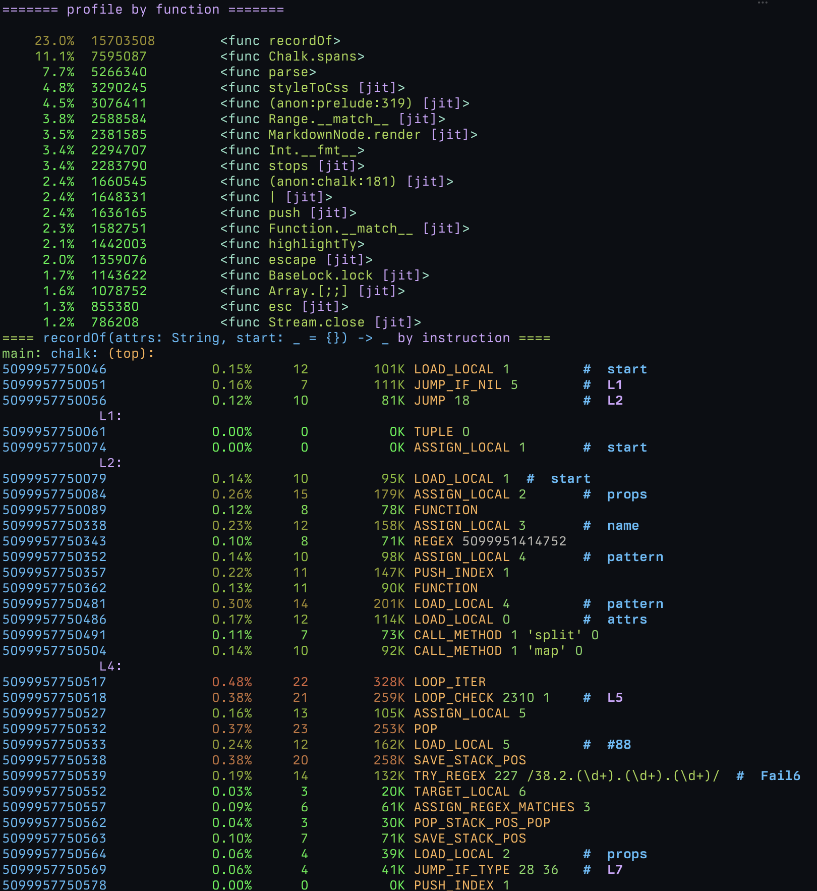
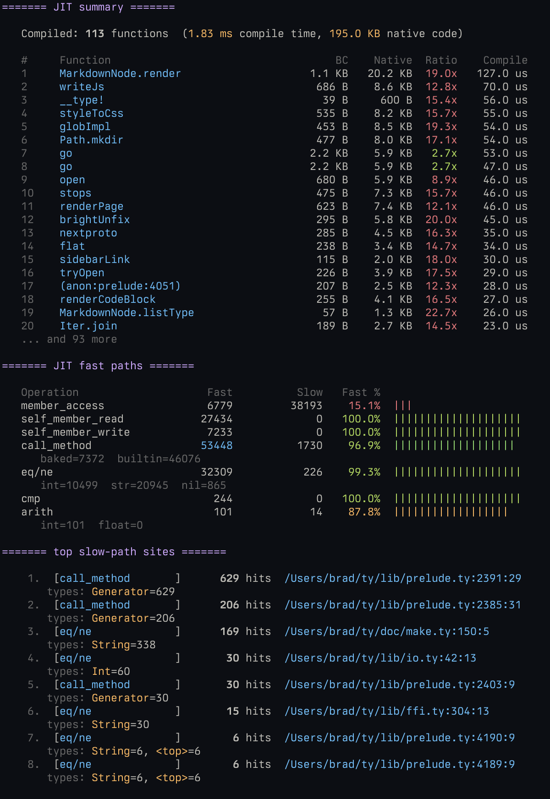

# Performance

## Ok but is it blazingly fast??

No. The bytecode interpreter is generally slower than CPython or YARV. The JIT compiler
is a bit faster, and often gets us firmly with the Python/Ruby performance range, but it's fairly
simplistic and of course doesn't come close to the performance of a mature JIT like V8 or LuaJIT.

## Some data

These results should be taken with a massive grain of salt as many of the programs were machine-translated, but here are some benchmarks comparing the bytecode interpreter and JIT compiler to CPython 3.14.3. The benchmark sources are available [here](https://github.com/marchelzo/ty/tree/master/perf). If you notice any issues with the benchmarks, feel free to open an issue or submit a PR, and I'll be happy to fix it.

### ty vs Python (no JIT)

<table class="bench-table">
<thead>
<tr><th>Benchmark</th><th>ty</th><th>Python</th><th>Ratio</th></tr>
</thead>
<tbody>
<tr><td><a href="https://github.com/marchelzo/ty/blob/master/perf/benchmarks/chaos.ty">chaos</a></td><td>128.65ms</td><td class="faster">68.57ms</td><td>1.88x</td></tr>
<tr><td><a href="https://github.com/marchelzo/ty/blob/master/perf/benchmarks/fannkuch.ty">fannkuch</a></td><td>835.49ms</td><td class="faster">435.70ms</td><td>1.92x</td></tr>
<tr><td><a href="https://github.com/marchelzo/ty/blob/master/perf/benchmarks/float_bench.ty">float</a></td><td>37.87ms</td><td class="faster">29.90ms</td><td>1.27x</td></tr>
<tr><td><a href="https://github.com/marchelzo/ty/blob/master/perf/benchmarks/generators.ty">generators</a></td><td class="faster">11.33ms</td><td>14.69ms</td><td>1.30x</td></tr>
<tr><td><a href="https://github.com/marchelzo/ty/blob/master/perf/benchmarks/nbody.ty">nbody</a></td><td>107.14ms</td><td class="faster">96.49ms</td><td>1.11x</td></tr>
<tr><td><a href="https://github.com/marchelzo/ty/blob/master/perf/benchmarks/nqueens.ty">nqueens</a></td><td>158.65ms</td><td class="faster">104.23ms</td><td>1.52x</td></tr>
<tr><td><a href="https://github.com/marchelzo/ty/blob/master/perf/benchmarks/raytrace.ty">raytrace</a></td><td>112.97ms</td><td class="faster">62.72ms</td><td>1.80x</td></tr>
<tr><td><a href="https://github.com/marchelzo/ty/blob/master/perf/benchmarks/recursion.ty">recursion</a></td><td>57.37ms</td><td class="faster">44.65ms</td><td>1.29x</td></tr>
<tr><td><a href="https://github.com/marchelzo/ty/blob/master/perf/benchmarks/richards.ty">richards</a></td><td>47.24ms</td><td class="faster">27.91ms</td><td>1.69x</td></tr>
<tr><td><a href="https://github.com/marchelzo/ty/blob/master/perf/benchmarks/spectral_norm.ty">spectral_norm</a></td><td>49.92ms</td><td>49.29ms</td><td>~1.00x</td></tr>
</tbody>
</table>

Total time: ty 1.547s &nbsp; Python 934.14ms 
Geometric mean: Python 1.37x faster 
Best: ty 1.30x faster (generators) 
Worst: Python 1.92x faster (fannkuch) 
Wins: ty 1 / Python 8 / tied 1

### ty vs Python (JIT)

<table class="bench-table">
<thead>
<tr><th>Benchmark</th><th>ty</th><th>Python</th><th>Ratio</th></tr>
</thead>
<tbody>
<tr><td><a href="https://github.com/marchelzo/ty/blob/master/perf/benchmarks/chaos.ty">chaos</a></td><td class="faster">57.19ms</td><td>68.98ms</td><td>1.21x</td></tr>
<tr><td><a href="https://github.com/marchelzo/ty/blob/master/perf/benchmarks/fannkuch.ty">fannkuch</a></td><td class="faster">177.71ms</td><td>436.58ms</td><td>2.46x</td></tr>
<tr><td><a href="https://github.com/marchelzo/ty/blob/master/perf/benchmarks/float_bench.ty">float</a></td><td class="faster">16.48ms</td><td>30.21ms</td><td>1.83x</td></tr>
<tr><td><a href="https://github.com/marchelzo/ty/blob/master/perf/benchmarks/generators.ty">generators</a></td><td class="faster">7.26ms</td><td>14.75ms</td><td>2.03x</td></tr>
<tr><td><a href="https://github.com/marchelzo/ty/blob/master/perf/benchmarks/nbody.ty">nbody</a></td><td class="faster">43.07ms</td><td>97.40ms</td><td>2.26x</td></tr>
<tr><td><a href="https://github.com/marchelzo/ty/blob/master/perf/benchmarks/nqueens.ty">nqueens</a></td><td class="faster">34.18ms</td><td>104.61ms</td><td>3.06x</td></tr>
<tr><td><a href="https://github.com/marchelzo/ty/blob/master/perf/benchmarks/raytrace.ty">raytrace</a></td><td class="faster">43.79ms</td><td>63.14ms</td><td>1.44x</td></tr>
<tr><td><a href="https://github.com/marchelzo/ty/blob/master/perf/benchmarks/recursion.ty">recursion</a></td><td class="faster">18.10ms</td><td>44.56ms</td><td>2.46x</td></tr>
<tr><td><a href="https://github.com/marchelzo/ty/blob/master/perf/benchmarks/richards.ty">richards</a></td><td class="faster">17.18ms</td><td>27.93ms</td><td>1.63x</td></tr>
<tr><td><a href="https://github.com/marchelzo/ty/blob/master/perf/benchmarks/spectral_norm.ty">spectral_norm</a></td><td class="faster">23.37ms</td><td>49.87ms</td><td>2.13x</td></tr>
</tbody>
</table>

Total time: ty 438.34ms &nbsp; Python 938.03ms 
Geometric mean: ty 1.98x faster 
Best: ty 3.06x faster (nqueens) 
Worst: ty 1.21x faster (chaos) 
Wins: ty 10 / Python 0

## Profiling Ty programs with `typrof`

Ty ships with an additional binary called `typrof` that can be used to profile Ty programs. Simply run `typrof <program>` to get a report of how much time was spent in each function. The default is to sample on every single instruction which can be very slow. You can pass `-F <Hz>` to sample at a particular frequency instead, which is usually more than sufficient for getting a good profile. Below is an example of its output.

